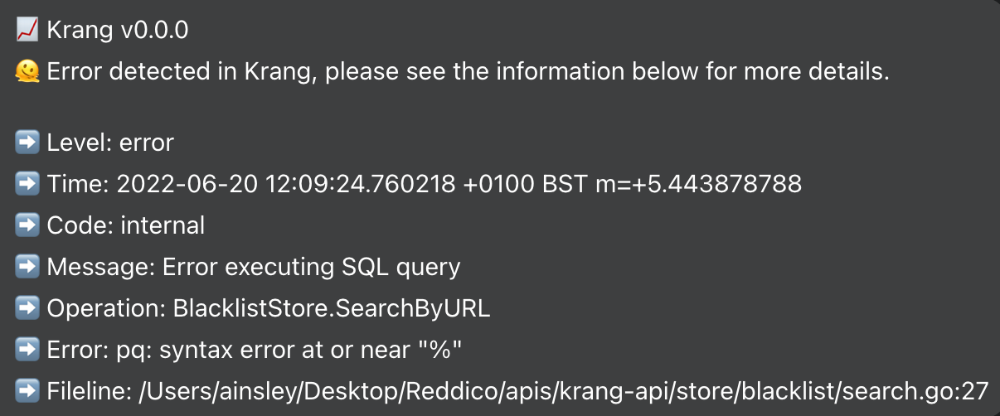

<div align="center">


[](http://golang.org)
[](https://goreportcard.com/report/github.com/ainsleyclark/logger)
[](https://codeclimate.com/github/ainsleyclark/logger/maintainability)
[](https://github.com/ainsleyclark/logger/actions/workflows/test.yml)
[](https://codecov.io/gh/ainsleyclark/logger)
[](https://pkg.go.dev/github.com/ainsleyclark/logger)

</div>

# ✏️ Logger

A Go wrapper for Logrus, Errors, Mongo and Facebook Workplace giving you extremely detailed log reports. This package is
designed to be used with [github.com/ainsleyclark/errors](https://github.com/ainsleyclark/errors) for error reporting
with codes, messages and more.

## Overview

- ✅ Log a wide variety of log levels.
- ✅ Logs with custom errors featuring codes, messages and lifelines.
- ✅ Beautiful middleware and formatters for entries (see screenshots below).
- ✅ Facebook Workplace integration, any error marked as `INTERNAL` will be sent to WP.
- ✅ Mongo integration, if specified log entries will be sent to a Mongo collection.

## Why?

Detailed and verbose logging is important to any application or API. This package aims to make it easy for APIs to log errors to a central location, using a Logrus Hook.



## Installation

```bash
go get -u github.com/ainsleyclark/logger
```

### Quick Start

Get started with the Logger by calling `logger.New()` and creating new options. The service is required, this is the
name of your currently running app.

```go
func QuickStart() error {
	err := logger.New(context.TODO(), logger.NewOptions().Service("service"))
	if err != nil {
		return err
	}

	logger.Trace("Trace Entry")
	logger.Debug("Debug Entry")
	logger.Info("Info Entry")
	logger.Warn("Warn Entry")
	logger.Error("Error Entry")
	logger.WithError(errors.NewInternal(errors.New("error"), "message", "op")).Error()
	logger.Fatal("Fatal Entry")

	return nil
}
```

**Outputs:**


### Fields

Fields allow you to log out key value pairs to the logger that will appear under data. The simplest way to use the
logger is simply the package-level exported logger.

```go
func Fields() {
	logger.WithFields(types.Fields{
		"animal": "walrus",
	}).Info("A walrus appears")
}
```

## Errors

This package is designed to work with [github.com/ainsleyclark/errors][https://github.com/ainsleyclark/errors] as such
the `WithError` function can be used to log deatiled and rich error data.

```go
func WithError() {
	logger.WithError(errors.NewInternal(errors.New("error"), "message", "op")).Error()
}
```

## Middleware

Middleware is provided out of the box in the form of a fire hook. Upon receiving a request from the API,
calling `logger.Fire`will send the log entry to stdout with detailed request information and meta.

```go
func Middleware(r *http.Request) {
	logger.Fire(logger.FireHook{
		Request:      r,
		Status:       http.StatusOK,
		Message:      "Message from API",
		Data:         map[string]any{},
		RequestTime:  time.Now(),
		ResponseTime: time.Now(),
		Latency:      100,
	})
}
```

## Recipes

### Simple

Creates a simple logger with stdout.

```go
func Simple() error {
	opts := logger.NewOptions().
		Service("service").
		Prefix("prefix").
		DefaultStatus("status")

	err := logger.New(context.Background(), opts)
	if err != nil {
		return err
	}

	logger.Info("Hello from Logger!")

	return nil
}
```

### WithWorkplace

Create a logger with Facebook Workplace integration. A token and a thread are required to send any error code that has
been marked as `errors.INTERNAL` to thread ID passed.

```go
func WithWorkplace() error {
	opts := logger.NewOptions().
		Service("api").
		WithWorkplaceNotifier("token", "thread", nil, nil)

	err := logger.New(context.Background(), opts)
	if err != nil {
		return err
	}

	logger.Info("Hello from Logger!")

	return nil
}
```

#### Workplace CallBack
You can pass a function to `WithWorkplaceNotifier` as the second argument which is a callback function to determine if
the message should be sent to a thread, an example is below:

```go
func WithWorkplaceReport() {
	// Don't send the message to workplace if there is no error.
	workplaceCallBack := func(entry types.Entry) bool {
		if !entry.HasError() {
			return false
		}
		return true
	}

	_ = logger.NewOptions().
	Service("api").
	WithWorkplaceNotifier("token", "thread", workplaceCallBack, nil)

	// etc
}
```

#### Workplace Formatter
You can pass a function to `WithWorkplaceNotifier` as the third argument which is a callback function to write the
message to Workplace. This is where you can customise the message easily and return a formatted string.

```go
func WithWorkplaceReport() {
	// Don't send the message to workplace if there is no error.
	workplaceCallBack := func(entry types.Entry) bool {
		if !entry.HasError() {
			return false
		}
		return true
	}

	_ = logger.NewOptions().
	Service("api").
	WithWorkplaceNotifier("token", "thread", workplaceCallBack, nil)

	// etc
}
```

### WithMongo

Create a logger with Mongo integration. All logs are sent to the collection passed
using [github.com/ainsleyclark/mogurs](https://github.com/ainsleyclark/mogurs).

```go
func WithMongo() error {
	clientOptions := options.Client().
		ApplyURI(os.Getenv("MONGO_CONNECTION")).
		SetServerAPIOptions(options.ServerAPI(options.ServerAPIVersion1))

	client, err := mongo.Connect(context.Background(), clientOptions)
	if err != nil {
		log.Fatalln(err)
	}

	opts := logger.NewOptions().
		Service("api").
		WithMongoCollection(client.Database("logs").Collection("col"))

	err = logger.New(context.Background(), opts)
	if err != nil {
		return err
	}

	logger.Info("Hello from Logger!")

	return nil
}
```

### KitchenSink

Boostrap all Log integrations.

```go
func KitchenSink() error {
	clientOptions := options.Client().
		ApplyURI(os.Getenv("MONGO_CONNECTION")).
		SetServerAPIOptions(options.ServerAPI(options.ServerAPIVersion1))

	client, err := mongo.Connect(context.Background(), clientOptions)
	if err != nil {
		log.Fatalln(err)
	}

	opts := logger.NewOptions().
		Service("service").
		Prefix("prefix").
		DefaultStatus("status").
		WithWorkplaceNotifier("token", "thread").
		WithMongoCollection(client.Database("logs").Collection("col"))

	err = logger.New(context.Background(), opts)
	if err != nil {
		return err
	}

	logger.Info("Hello from Logger!")

	return nil
}
```
